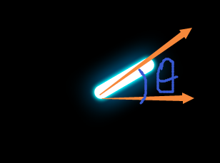

# 复习线性代数
1. 向量点乘
	公式: a * b = ||a|| * ||b|| * cos(Θ) = ax * bx + ay * by + az * bz
	
* **计算两个向量的夹角**  
```根据cos(Θ)的曲线，可以知道在(-90~90)之间为正数,(90~270)之间为负数```

    例如:摇杆的旋转方向,可以算出摇杆中心位置到手指触摸点的向量和摇杆沿着X轴方向的向量求出Θ角,
    但是因为余弦值在第二象限和第三象限 或者第一象限和第四象限中存在相同的值,所以需要使用其他的点积来区分

    所以可以利用cos曲线的特性,计算摇杆中心位置到手指触摸点的向量和沿Y轴正方向的向量点乘的积,
    如果大于等于0,说明此时摇杆中心位置到手指触摸点的向量在第二象限Θ角不变,反之处于第三象限,此时应为角度应为(360-Θ)
    同理可以用沿Y轴负方向的向量来区分第一和第四象限
    ```lua
        self._pointer = cc.Sprite:create("em_line.png")
        self._pointer:setAnchorPoint(cc.p(0,0.5))
        self:addChild(self._pointer)
        self._pointer:setPosition(cc.p(display.cx,display.cy))


        local centerPoint = cc.p(display.cx,display.cy)
        --从中心点向右1个单位的向量
        local rightVector = cc.p(1,0)
        local topVector = cc.p(0,1)
        local bottomVector = cc.p(0,-1)
        local processFunc = function(touch) 
            --从中心点到点击点的向量
            local clickPos = touch:getLocation()
            local clickVector = cc.pSub(clickPos,centerPoint)


            --求出两个向量的夹角
            --根据向量点乘公式 a * b = ||a|| * ||b|| * cos(Θ) = ax * bx + ay * by + az * bz
            local cosA = cc.pDot(cc.pNormalize(clickVector),rightVector)
            local A = math.acos(cosA)
            --根据cos(Θ)的曲线，可以知道在(-90~90)之间为正数,(90~270)之间为负数
            --如果向量与垂直向上的向量余弦值小于0,说明在第二或者第三象限
            A = (A/math.pi) * 180
            --区分第二象限和第三象限
            if cosA < 0 then
                print("cosA < 0")
                --注意此时的角度无法区分是否在第二象限或者第三象限
                --那么可以让中心到点击点的向量跟垂直向量求点积,如果为正,说明在第二象限,否则为第三象限
                --处于第三象限的话角度应该为360-Θ
                local cosB = cc.pDot(cc.pNormalize(clickVector),topVector)
                if cosB < 0 then
                    A = 360 - A
                end
            else
                --区分第一象限和第四象限
                --如果是第四象限  用360-A
                local cosB = cc.pDot(cc.pNormalize(clickVector),bottomVector)
                if cosB > 0 then
                    A = 360 - A
                end
            end

            --因为cocos顺时针旋转的,所以这里需要用360 - A
            A = 360 - A
            self._pointer:setRotation(360-A)
        end


        
        local function onNodeTouchBegan(touch, event)
            processFunc(touch)
            return true
        end

        local function onNodeTouchMoved(touch, event)
            processFunc(touch)
        end


        local listener = cc.EventListenerTouchOneByOne:create()
        listener:setSwallowTouches(true)
        listener:registerScriptHandler(onNodeTouchBegan, cc.Handler.EVENT_TOUCH_BEGAN)
        listener:registerScriptHandler(onNodeTouchMoved, cc.Handler.EVENT_TOUCH_MOVED)
        local eventDispatcher = self:getEventDispatcher()
        eventDispatcher:addEventListenerWithSceneGraphPriority(listener, self)
    ```
  

* **向量/矢量的分解**  
``` 速度向量可以根据平行四边形法则进行分解,如果将速度向量分解到X/Y轴方向上的话，如果物体在X方向上发生碰撞，那么只需要将X方向的向量进行反向,(Y方向同理)那么就会模拟碰撞的情况```
```lua
--设置速度向量
function Bubble:setVolicity(volicity)
    self._volicity = volicity
end

function Bubble:update(dt)
    local pos = cc.p(self:getPosition())
    pos = cc.pAdd(pos , cc.pMul(self._volicity , dt))
    --气泡的边界
    local box = self._boxNode:getCascadeBoundingBox()
    local wpos = self:getParent():convertToWorldSpace(pos)
    
    if wpos.x - box.width/2 <= 0 then
        --气泡的左边界是否超出屏幕,如果超出,那么X方向分量反向
        self._volicity.x = -1 * self._volicity.x
        pos.x = box.width/2
    elseif wpos.x + box.width/2 >= display.width then
        --气泡的右边界是否超出屏幕,如果超出,那么对X方向的分量反向
        self._volicity.x = -1 * self._volicity.x
        pos.x = display.width - box.width/2
    elseif wpos.y - box.height/2 <= 0 then
        --气泡的下边界是否超出,如果超出,对Y分量进行反向
        self._volicity.y = -1 * self._volicity.y
        pos.y = box.height/2
    elseif wpos.y + box.height/2 >= display.height then
        --气泡的上边界是否超出,如果超出,对Y分量进行反向
        self._volicity.y = -1 * self._volicity.y
        pos.y = display.height - box.height/2
    end
    self:setPosition(pos)
end
```

```根据向量的分解计算圆形和长方形的碰撞```  


已知圆心C点，和长方形中心B点,向量CB可以分成水平和竖直两个方向,然后约束两个方向的范围，
最后竖直方向的分量 + CB向量 - clamped.x 可以得到CP向量
```c
GLboolean CheckCollision(BallObject &one, GameObject &two) // AABB - Circle collision
{
    // 获取圆的中心 
    glm::vec2 center(one.Position + one.Radius);
    // 计算AABB的信息（中心、半边长）
    glm::vec2 aabb_half_extents(two.Size.x / 2, two.Size.y / 2);
    glm::vec2 aabb_center(
        two.Position.x + aabb_half_extents.x, 
        two.Position.y + aabb_half_extents.y
    );
    // 获取两个中心的差矢量
    glm::vec2 difference = center - aabb_center;
    glm::vec2 clamped = glm::clamp(difference, -aabb_half_extents, aabb_half_extents);


    
    // AABB_center加上clamped这样就得到了碰撞箱上距离圆最近的点closest
    glm::vec2 closest = aabb_center + clamped;
    // 获得圆心center和最近点closest的矢量并判断是否 length <= radius
    difference = closest - center;
    return glm::length(difference) < one.Radius;
}  
```

2. 向量的叉乘
	公式: a × b = [ ax,ay ] × [ bx,by]  =  x1 * y2 - y1 * x2 

	向量的叉乘求出来的是一个向量,这个向量垂直于a,b所在的平面，根据右手定则可以判断该向量的方向
	右手四指从a向量绕向b向量,大拇指所指的方向就是该向量的方向
	根据右手定则，我们可以判断出以下几点
	* 假设求出来的向量为c,如果a在b的右边,那么c在(a,b,c)组成的坐标系中，方向为正,否则为负，如果等于0则意味着两个向量共线。

	应用:
		判断点P在多边形内部：根据向量叉乘，按照逆时针（顺时针）取向量进行叉乘，所得值同号，则说明点在多边形内部  
     


